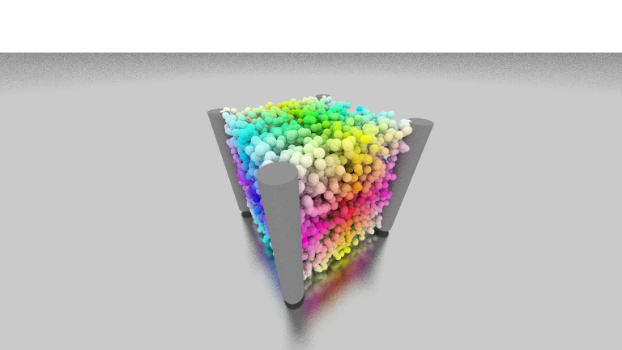

# Computer graphics - Basic course

## Multithreaded Raytracer written in Java

### Features:

* implemented multiple shapes such as:
    - Spheres
    - Cylinders
    - Disks
    - Cones
* supports transformations such as:
    - rotation
    - moving
* multicore optimized rendering
* multiple materials such as:
    - diffuse
    - glass
    - glossy/reflective
    - textures (todo)
* skyboxes (todo)
* bounding boxes (todo)
* depth of field (todo)

### Renders

<!-- vim: set spelllang=de: -->
